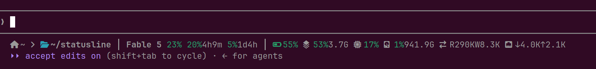

# statusline

A fast, compact statusline for [Claude Code](https://claude.com/claude-code),
written in C. It reads the status JSON Claude Code pipes on stdin, samples
system metrics from `/proc` and `/sys`, and prints one color-coded line in
about **1.8 ms** — cheap enough to refresh every second.



```
 launch ›  current │ Model ctx% 5h%reset 7d%reset │ BAT RAM CPU DISK IO NET
```

## Features

- **Directories** — launch dir and current dir, collapsed into one when they
  match, with `~` substitution and middle-elision for long paths
- **Model + context** — active model name and context-window usage %
- **Plan usage** — the 5-hour and 7-day rate-limit windows with a countdown to
  each reset (`20%4h9m`), straight from the official `rate_limits` data Claude
  Code provides — no transcript scraping or extra API calls
- **Battery** — charge % with a level glyph, `⚡` while charging
- **RAM & disk** — used % plus free space at a glance (`53%3.7G`)
- **CPU, disk IO, network** — true rates computed from `/proc` deltas between
  refreshes, persisted per session (concurrent Claude sessions don't corrupt
  each other's readings)
- **Color as the signal** — green when fine, amber at ≥70%, red at ≥80% for
  percentages; battery inverted (amber ≤30%, red ≤15%); IO/net stay uncolored
  until they cross 10 MiB/s (amber) or 30 MiB/s (red)
- **Never breaks a render** — malformed stdin, missing fields, unreadable
  `/proc`, corrupt state: every segment fails soft and is simply omitted
- **Zero runtime dependencies** — a single plain-libc binary; cJSON is
  vendored and compiled in

Designed for a **Linux laptop**: it expects `/proc` + `/sys/class/power_supply`
(Linux-only — no macOS/BSD) and skips loopback/virtual NICs and non-physical
disks when summing traffic. On a desktop or VM it still works — the battery
segment just disappears.

## Prerequisites

- **Linux** with `/proc` and `/sys` (any modern distro; the battery segment
  needs `/sys/class/power_supply/BAT*`)
- **To build**: `gcc`, `make`, and libc headers — on Debian/Ubuntu:
  `sudo apt install gcc make libc6-dev`
- **A Nerd Font (v3)** in your terminal for the glyphs (e.g. JetBrainsMono
  Nerd Font) — or set `CLAUDE_STATUSLINE_NERD=0` for plain-text labels
- `make test` (optional) also needs `python3` and `bash` for the parity
  harness against the Python reference

## Build

```
make            # gcc -O2 -Wall -Wextra, links vendor/cJSON
make test       # byte-for-byte parity vs statusline.py reference
```

## Deploy

Point `statusLine` at the binary in `~/.claude/settings.json`:

```json
"statusLine": {
  "type": "command",
  "command": "/path/to/statusline/statusline-bin",
  "padding": 0,
  "refreshInterval": 1
}
```

## Tuning

All thresholds are `#define`s in the CONFIG block at the top of `statusline.c`
(`SYS_WARN`/`SYS_BAD`, `USE_WARN`/`USE_BAD`, `RATE_WARN`/`RATE_BAD`,
`RATE_MIN_INTERVAL`). Change, `make`, done.

## Files

- `statusline.c` — the implementation
- `statusline.py` — the original Python implementation, kept as the reference
  spec; `test/parity.sh` diffs the two byte-for-byte on generated inputs
- `vendor/cJSON.{c,h}` — vendored [cJSON](https://github.com/DaveGamble/cJSON) v1.7.18 (MIT)
