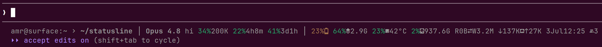

# statusline

A fast, compact statusline for [Claude Code](https://claude.com/claude-code),
in one C file. Reads Claude's status JSON on stdin, samples `/proc` + `/sys`,
prints one color-coded line in ~**0.7 ms**.



```
 user@host:launch › current │ Model effort ctx%size 5h%reset 7d%reset │ BAT RAM CPU°temp DISK IO NET date session#
```

## Features

- **Directories**: `user@host:` prefix, launch and current dir, `~`-shortened; collapsed when equal
- **Model + context**: active model name, reasoning-effort level, context-window usage % and max size (`18%200K`)
- **Plan usage**: 5h and 7d windows with reset countdowns (`20%4h9m`); subscribers only
- **Battery**: charge % with a level glyph, distinct while charging; time since full (`3h20m`), hidden while charging or after a partial recharge
- **RAM, disk & CPU**: used % plus free space or package temperature (`53%3.7G`, `12%45°C`)
- **Disk IO, network**: true rates from `/proc` deltas, tracked per session without collisions
- **Date, time & sessions**: local clock plus a live count of other open Claude Code sessions
- **Zero disk writes**: state (~100 bytes/session) lives in tmpfs (`$XDG_RUNTIME_DIR`), vanishes at logout; stale sessions' state self-cleans after 5 minutes
- **Color as the signal**: green/amber/red at 70/80%; battery inverted; IO/net at 10/30MiB/s
- **Never breaks a render**: malformed stdin, missing fields, unreadable `/proc`: segments fail soft
- **Self-contained**: one `.c` file, nothing beyond libc; the JSON reader is ~180 lines of it
- **Lean by measurement**: ~19-27 syscalls depending on enabled segments, zero allocations, zero writes at steady state

Built for a **Linux laptop** on a **Claude subscription**. Desktops, VMs, and
API-key billing still work: the missing segments just disappear.

## Prerequisites

- Linux with `/proc` and `/sys`; battery needs `/sys/class/power_supply/BAT*`, CPU temp needs an `x86_pkg_temp` thermal zone (Intel)
- `gcc`, `make`, libc headers (`sudo apt install gcc make libc6-dev`); optional `musl-tools` for ~10× faster init
- A Nerd Font (v3) **Mono** variant for glyphs (the regular variant overflows its cell by up to 39% on some icons), or `CLAUDE_STATUSLINE_NERD=0` for plain text
- `make test` also needs `python3` and `bash`

## Build & deploy

```
make            # single .c, static; prefers musl-gcc, falls back to gcc
make test       # byte-for-byte parity vs the Python reference
```

Then point `statusLine` at the binary in `~/.claude/settings.json`:

```json
"statusLine": {
  "type": "command",
  "command": "/path/to/statusline/statusline-bin",
  "padding": 0,
  "refreshInterval": 1
}
```

## Tuning

Thresholds are `#define`s in the CONFIG block atop `statusline.c`. Change, `make`, done.

## Local preview + profiling

No cloud CI: `make preview` (or `scripts/preview.sh`) builds, runs the parity
suite, prints syscall/timing profiling, and regenerates two local artifacts
mocked inside the bit of Claude Code's own UI that surrounds the statusline -
`docs/statusline-preview.txt` (the real ANSI output; `cat` it in a terminal
with the same Nerd Font, or paste it directly) and `docs/statusline-preview.png`
(rendered with [VHS](https://github.com/charmbracelet/vhs), since GitHub
won't render ANSI in a code block; needs `vhs` on `PATH` plus `ttyd` and
`ffmpeg` - `sudo apt install ttyd ffmpeg`).

Run it automatically before every commit that touches the implementation:

```
git config core.hooksPath githooks
```

## Files

- `statusline.c`: the entire implementation
- `statusline.py`: Python reference; `test/parity.sh` diffs the two byte-for-byte
- `scripts/preview.sh`, `githooks/pre-commit`: local preview + profiling, no CI service
